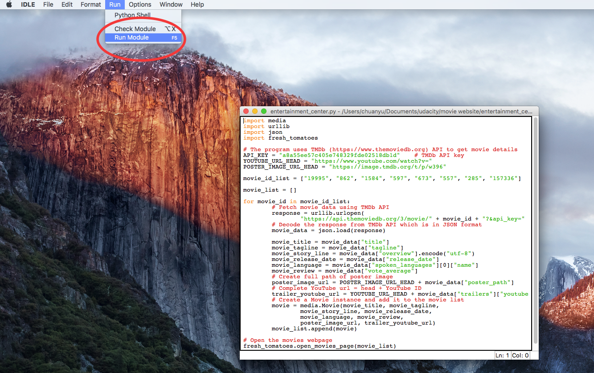

# Movie Webpage Project README
## Introduction
The program uses Python code to store the details of a list of movies, include movies' box art imagery and movie trailer URLs and generates a static responsive webpage allowing visitors to browse movie details and watch the trailers.

The movie information is retrieved using TMDb API

## Technologies Used
- Back-end: Python
- front-end: Boostrap 
- API: TMDb 

## Usage
1. Open entertainment_center.py file using IDLE
2. Run the module using IDLE
3. Use a browser to open fresh_tomatoes.html

